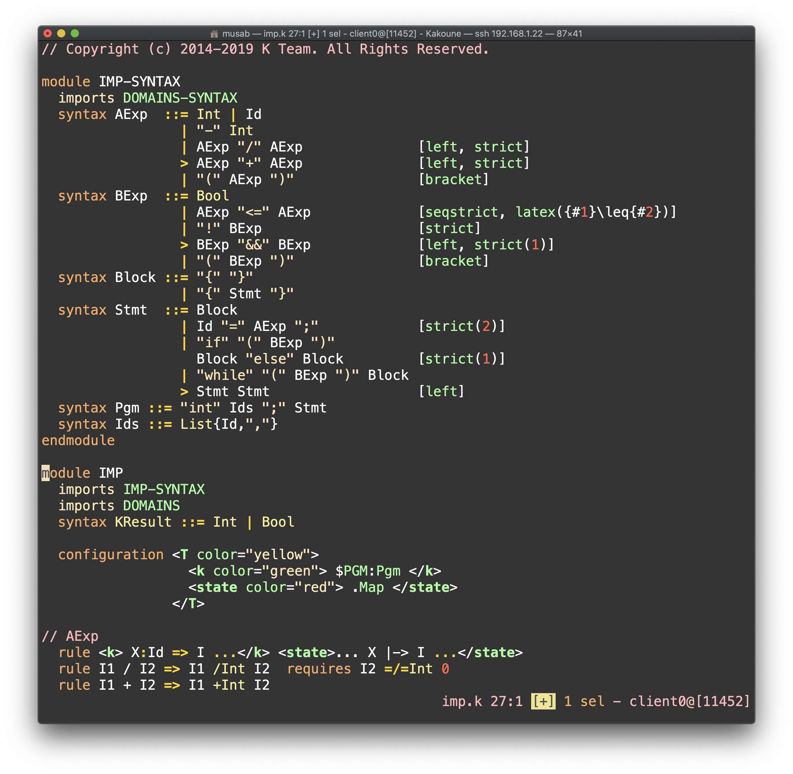

# k-kak

Basic syntax highlighting for K ([the K
Framework](https://github.com/kframework/k)) in the [Kakoune text
editor](https://kakoune.org).

## Overview

Syntax highlighting definitions are given in the file `k.kak`. The file
defines different highlighting regions, including a region for K code (the
default region), a region for string literals, a comments region, and another
region for K cell tags. Regions contain the various highlighers (keywords,
builtin operators, attributes ... etc). The definitiion also includes
specification for automatic indentation and automatic removal of trailing
whitespaces, among other details. If you are interested to learn more, see
[this post](https://zork.net/~st/jottings/Intro_to_Kakoune_highlighters.html)
for a gentle introduction to defining
kakoune highlighters and the official [reference
document](https://github.com/mawww/kakoune/blob/master/doc/pages/highlighters.asciidoc).
`k.kak` uses the same structure used in other definitions that come bundled
with kakoune.

*Note: Syntax highlighting in `k.kak` does not attempt to be anywhere near
perfect. It's more of a "looks sensible" kind of highlighting. Suggestions
for improvement are encouraged, so please feel free to raise issues or
suggest changes through this Github repo.*

## Screenshot

This is a fragment from the the language imp (from the K tutorials
[here](https://github.com/kframework/k/blob/master/k-distribution/tutorial/1_k/2_imp/lesson_4/imp.k))
highlighted by `k-kak`:



## Installation

There are generally two options to install `k-kak`:

**Option 1:** Copy the file `k.kak` to your kakoune's directory of syntax
highlighting definitions, and kakoune will load it automatically. The
exact location of this directory depends on your system and how kakoune was
installed. In my case (a Ubuntu machine with kakoune compiled from source),
that directory is `~/.local/share/kak/autoload/filetype`.

**Option 2:** If you don't want to mess with your kakoune's installation
(or don't have write access priviledges to where kakoune is installed), you
may copy `k.kak` to the current user's kakoune config directory located at
`~/.config/kak/autoload`. You may create this directory if it doesn't exist,
and then copy `k.kak` there.

**Note:** If you are creating this directory `~/.config/kak/autoload`,
kakoune will only load the definitions listed in this new directory, unless the
directory contains a symlink to the system-wide `autoload` directory mentioned
at Option 1 above (which in my case is `~/.local/share/kak/autoload`). So,
here are the steps in detail:

   1. create the user-level configuration directory, and change to it:

   ```sh
   mkdir ~/.config/kak/autoload
   cd ~/.config/kak/autoload
   ```

   2. Create a symlink inside this directory that points to the system-wide `autoload` folder. In my case, the command was:

   ```sh
   ln -s ~/.local/share/kak/autoload autoload
   ```

   3. Finally, copy over `k.kak` from this repo to the current directory. Kakoune will now load all the
      definitions that come bundled with it, along with our new addition `k.kak`.

## Pro Tip!

Kakoune's markdown syntax highlighting supports highlighting code snippets
within code blocks, and this includes external definitions like `k.kak`. To
enable it, the only thing the you need to do is add `k` to the list of
languages supported by the markdown highlighter (assuming you have write
access to it), as follows:

1. Locate your system-wide syntax highlighting definitions bundled with kakoune (in my case, it's the
   directory `~/.local/share/kak/autoload/filetype`).

2. Open up the file `~/.local/share/kak/autoload/filetype/markdown.kak` for editing.

3. Look for the line defining a variable named `languages=...`. You will see it's a string of space-delimited
   list of languages supported. Just add `k` to this string and save your changes.

Below is screenshot of K definitions being
highlighted inside various `k` code blocks in K's builtin
[domains.md](https://github.com/kframework/k/blob/master/k-distribution/include/kframework/builtin/domains.md)
file markdown file:


*Note: automatic removal of trailing whitespace does not seem to work inside
markdown code blocks for some reason.*

## Feedback and Suggestions

Feel free to report problems by raising Github issues, or suggest improvements
by making Github pull requests.


